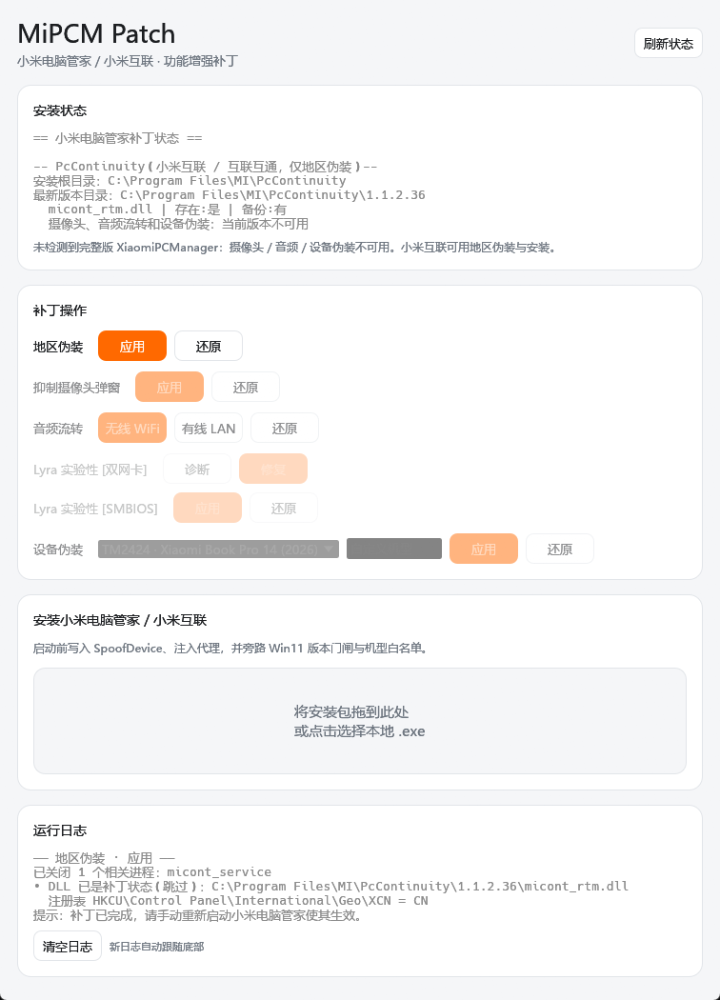

# MiPCM Patch

为「小米电脑管家 / 小米互联」提供功能增强与还原能力的补丁工具。支持图形界面与命令行两种使用方式。



## 能做什么

| 功能 | 说明 |
|---|---|
| 🗺️ **地区伪装** | 让小米电脑管家读取指定的地区值（默认 `CN`），不修改系统真实地区 |
| 📷 **抑制摄像头误报弹窗** | 屏蔽「摄像头暂不可用，点击确定打开设备管理器」这类本机摄像头被误判禁用的弹窗 |
| 🔊 **音频流转增强** | 在无线 WiFi 与有线 LAN 之间切换音频流转的网络介质 |
| 💻 **设备伪装** | 伪装为指定机型，解锁机型相关功能 |
| 📦 **安装小米电脑管家** | 自动查找或下载安装包，释放必要的补丁文件后启动安装 |
| 📊 **状态查看** | 检查当前安装位置、各补丁状态 |

每个功能均提供一键还原，所有补丁操作幂等、可重复执行。

## 下载

从 [Releases](../../releases) 页面下载最新版本：

- `MiPCM_GUI_v*.*.*.exe` — 图形界面（推荐）
- `MiPCM_CLI_v*.*.*.exe` — 命令行工具

## 快速开始

### 图形界面

双击 `MiPCM_GUI_*.exe`，在弹出的 UAC 窗口中点击「是」，即可看到补丁操作界面：

1. 点击「刷新状态」查看当前安装情况
2. 按需点击各功能的「应用」按钮
3. 出问题时点击对应「还原」即可恢复

支持将 `.exe` 安装包拖入窗口进行安装。

### 命令行

```text
# 查看状态
MiPCM_CLI.exe status

# 地区伪装
MiPCM_CLI.exe locale apply
MiPCM_CLI.exe locale revert

# 抑制摄像头弹窗
MiPCM_CLI.exe camera apply
MiPCM_CLI.exe camera revert

# 音频流转
MiPCM_CLI.exe audio apply --mode lan     # 有线模式
MiPCM_CLI.exe audio apply --mode wifi    # 无线模式
MiPCM_CLI.exe audio revert

# 设备伪装
MiPCM_CLI.exe device apply --model TM2424
MiPCM_CLI.exe device revert

# 安装小米电脑管家
MiPCM_CLI.exe install
MiPCM_CLI.exe install --installer "D:\path\to\installer.exe"
```

无参数运行会进入交互菜单。

## 常见问题

<details>
<summary>为什么需要管理员权限？</summary>

补丁需要修改 `C:\Program Files` 下的文件，因此需要管理员权限。Release 版 exe 已内嵌管理员权限清单，双击运行时会自动弹出 UAC。
</details>

<details>
<summary>补丁后需要重启电脑吗？</summary>

不需要。补丁前工具会自动关闭相关进程，补丁后手动重新打开小米电脑管家即可。
</details>

<details>
<summary>有线音频流转出现重复设备怎么办？</summary>

在手机端将该电脑「移除 / 忘记」后重新配对即可。
</details>

<details>
<summary>只安装了「小米互联」能用吗？</summary>

「小米互联」(PcContinuity) 仅支持**地区伪装**功能。摄像头弹窗、音频流转、设备伪装等功能需要完整版「小米电脑管家」(XiaomiPCManager)。
</details>

<details>
<summary>操作失败提示"拒绝访问"怎么办？</summary>

工具会自动关闭对应进程并重试一次。如果仍然失败，请手动关闭小米电脑管家相关进程后重试。
</details>

## 技术说明

补丁原理、定位方式、实现细节与构建说明详见 [TechnicalIntroduce.md](TechnicalIntroduce.md)。

## 免责声明

本工具所用图标归北京小米移动软件有限公司所有，受相关版权法律保护。未经授权，禁止任何形式的复制、分发、展示或使用这些图标。

本工具仅供学习和研究使用，作者不对因使用本工具而导致的任何直接或间接损失承担责任。使用者应自行承担使用本工具的风险，并确保其行为符合当地法律法规。
